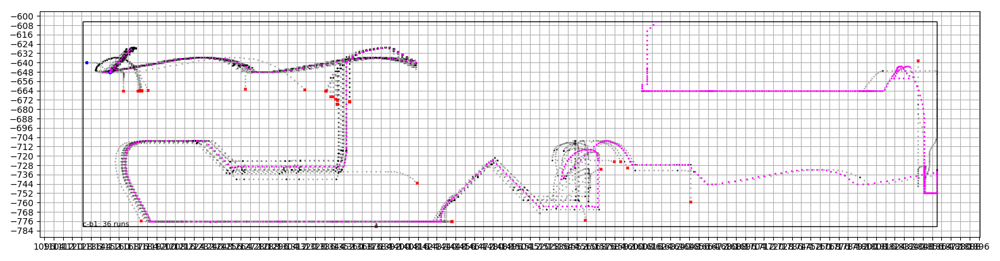
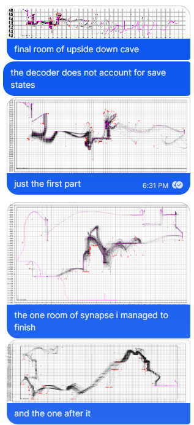

`main.py`
dumps timestamp raw game state info into the binary file `<timestamp>.dat`. Terminate with a keyboard interrupt. Something like 50 or so MB per hour of in-map duration (chapter select doesn't tend to generate new states).

When a state takes longer than 1/60 of a second (i.e. 1 frame at 60 fps) to change, the script prints the duration in frames. Typically this is due to a respawn or menu transition.

`decode.py <data file> [room name] [room name] ...`
loads the data file, chunks by room, splits up rooms into 'runs' (sequences of states ending in death, room change, or an unhandled msg), and logs some metadata about the rooms to `<data file>_index.json`. Then if room names are given, it plots the runs from named rooms. If no rooms are given, it just lists the available rooms and their combined run counts.

Example output:
```
$ python -u decode.py twm-2023-05-10-142030.dat c-b1
c-01: 3 runs
c-02: 3 runs
c-03: 21 runs
c-04: 12 runs
c-b1: 36 runs
c-06: 32 runs
c-07: 8 runs
e-x1: 1 runs
e-02: 15 runs
b-x4: 1 runs
b-03: 2 runs
b-05: 26 runs
b-04: 1 runs
b-06: 3 runs
b-07: 4 runs
b-08: 7 runs
b-01: 2 runs
f-01: 2 runs
b-02: 2 runs
c-g1: 1 runs
c-g2: 2 runs
c-g3: 24 runs
c-g4: 13 runs
c-g5: 1 runs
c-g6: 40 runs
c-b2: 15 runs
c-05: 4 runs
```

Example: 40 runs of a hidden berry room from the wednesday machine



* black dots are positions in a run that ends in a death
* red x's are deaths
* magenta dots are positions not ending in a death (including ending in a watchtower, for example)
* large blue dots are the starts of runs (respawn or room transition)
* the grid size is 8 pixels (1 in-game tile)
* currently other game state information (velocity, frame number, player state, entity interactions) are not rendered
* currently does not handle save states. my sorry.

In the example image, the magenta sequence corresponds to:
1. reverse wavedash right
1. wavedash right
1. hit spring
1. dash down
1. dash left
1. dash left
1. dash up left
1. fall
1. dash right 4 times
1. stop
1. jump right
1. dash up right
1. dash down right
1. dash right
1. dash up
1. fall left
1. dash up right
1. dash right
1. wavedash right
1. wavedash right
1. dash down into kevin
1. walk left off kevin
1. dash right into kevin
1. land and crouch
1. walk left
1. jump up
1. dash up to exit room


h2. Applications 

Timestamped gamestate data can be used in automatic video editing. For example, knowing the start time of a gameplay recording, the video can be edited to show only runs containing a room transition (i.e. the first and last attempt of each room).

It may also be possible to detect and count tech in a room.

It may be helpful to inform level design processes that start with a sequence of actions and then build a map around them or ascertaining patterns in personal gameplay preferences.

It may permit maps to be analyzed in the context of rhythm games i.e. as a sort of sheet music.

## Additional Graphs



